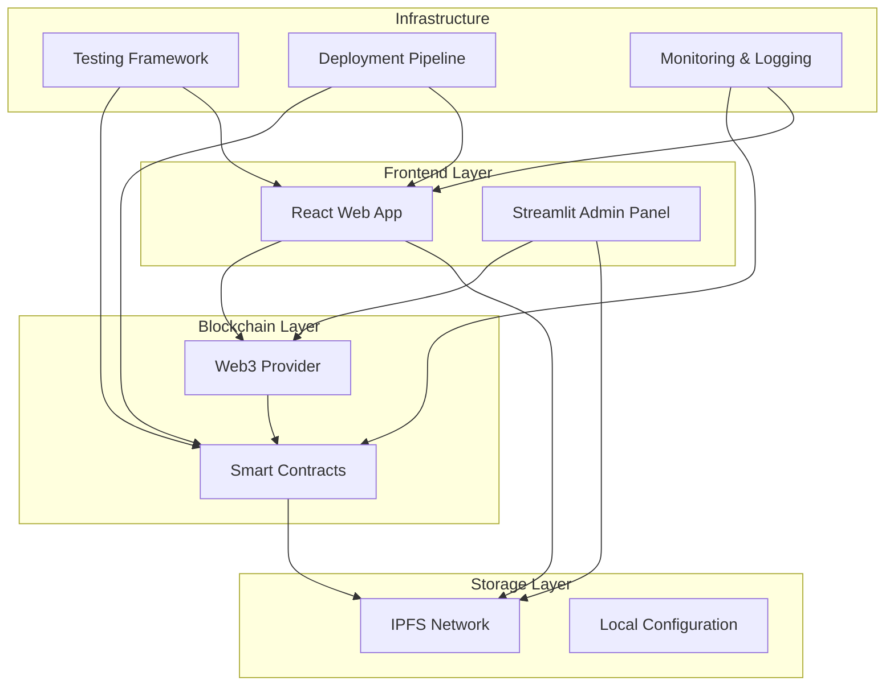

# Design Document

## Overview

This design addresses the critical issues in the existing blockchain document signing application and transforms it into a production-ready system. The enhanced architecture focuses on security, scalability, user experience, and maintainability while preserving the core functionality of blockchain-based document signing.

The system will support multiple blockchain networks, comprehensive testing, proper dependency management, enhanced security measures, and improved user workflows. The design follows industry best practices for smart contract development, frontend architecture, and DevOps integration.

## Architecture

### High-Level Architecture



### Smart Contract Architecture

The smart contract layer will be restructured with proper dependency management and enhanced security:

1. **Base Contract**: Core signing functionality with OpenZeppelin integration
2. **Factory Contract**: Deploy individual signing contracts for each document
3. **Registry Contract**: Track all deployed contracts and provide discovery
4. **Access Control**: Role-based permissions and multi-signature capabilities

### Frontend Architecture

Both React and Streamlit frontends will be enhanced with:

1. **State Management**: Proper state handling for complex workflows
2. **Error Boundaries**: Comprehensive error handling and user feedback
3. **Configuration Management**: Environment-based configuration system
4. **Testing Integration**: Unit and integration test coverage

## Components and Interfaces

### Smart Contract Components

#### 1. DocumentSignerFactory.sol
- **Purpose**: Deploy and manage individual document signing contracts
- **Key Functions**:
  - `createSigningContract(bytes32 documentHash, string ipfsCid, address[] signers)`
  - `getContractsByInitiator(address initiator)`
  - `getContractsByDocument(bytes32 documentHash)`

#### 2. Enhanced DocumentSigner.sol
- **Purpose**: Individual contract for each document signing process
- **Key Features**:
  - OpenZeppelin ReentrancyGuard and Ownable integration
  - Sequential signing support (optional)
  - Signer replacement functionality
  - Document versioning support
  - Gas optimization

#### 3. SigningRegistry.sol
- **Purpose**: Global registry for contract discovery and analytics
- **Key Functions**:
  - `registerContract(address contractAddress, bytes32 documentHash)`
  - `getContractsByStatus(SigningStatus status)`
  - `getSigningStatistics()`

### Frontend Components

#### React Application Structure
```
src/
├── components/
│   ├── WalletConnection/
│   ├── DocumentUpload/
│   ├── SigningWorkflow/
│   ├── StatusDashboard/
│   └── ErrorBoundary/
├── hooks/
│   ├── useWeb3/
│   ├── useContract/
│   └── useIPFS/
├── services/
│   ├── contractService.js
│   ├── ipfsService.js
│   └── configService.js
├── utils/
│   ├── errorHandling.js
│   ├── validation.js
│   └── constants.js
└── config/
    ├── development.js
    ├── production.js
    └── test.js
```

#### Streamlit Application Enhancement
- Modular page structure with proper navigation
- Enhanced error handling and user feedback
- Configuration management for different environments
- Integration with the same backend services as React app

### Configuration Management

#### Environment Configuration System
```javascript
// config/index.js
const configs = {
  development: {
    rpcUrl: 'http://127.0.0.1:8545',
    ipfsGateway: 'https://ipfs.io/ipfs/',
    nftStorageKey: process.env.NFT_STORAGE_KEY_DEV,
    contractAddresses: {
      factory: process.env.FACTORY_ADDRESS_DEV,
      registry: process.env.REGISTRY_ADDRESS_DEV
    }
  },
  production: {
    rpcUrl: process.env.RPC_URL_PROD,
    ipfsGateway: 'https://gateway.pinata.cloud/ipfs/',
    nftStorageKey: process.env.NFT_STORAGE_KEY_PROD,
    contractAddresses: {
      factory: process.env.FACTORY_ADDRESS_PROD,
      registry: process.env.REGISTRY_ADDRESS_PROD
    }
  }
};
```

## Data Models

### Smart Contract Data Structures

#### Enhanced Signature Structure
```solidity
struct Signature {
    address signer;
    uint256 timestamp;
    bytes32 documentVersion;  // Track document version at signing time
    string metadata;          // Additional signing metadata
}

struct SigningContract {
    bytes32 documentHash;
    string ipfsCid;
    address initiator;
    address[] requiredSigners;
    mapping(address => bool) hasSigned;
    Signature[] signatures;
    SigningStatus status;
    bool sequentialSigning;
    uint256 currentSignerIndex;
}

enum SigningStatus {
    INITIATED,
    IN_PROGRESS,
    COMPLETED,
    CANCELLED
}
```

#### Document Metadata Structure
```solidity
struct DocumentMetadata {
    string title;
    string description;
    uint256 createdAt;
    address creator;
    bytes32[] versions;  // Track document versions
    string[] ipfsCids;   // Corresponding IPFS CIDs for versions
}
```

### Frontend Data Models

#### Contract State Interface
```typescript
interface ContractState {
  address: string;
  documentHash: string;
  ipfsCid: string;
  requiredSigners: string[];
  signatures: Signature[];
  status: SigningStatus;
  isFullySigned: boolean;
  currentUserCanSign: boolean;
}

interface AppState {
  wallet: WalletState;
  contracts: ContractState[];
  currentContract: ContractState | null;
  loading: boolean;
  error: string | null;
}
```

## Error Handling

### Smart Contract Error Handling

#### Custom Error Types
```solidity
error NotAuthorizedSigner(address signer);
error AlreadySigned(address signer);
error DocumentNotFound(bytes32 documentHash);
error InvalidSigningOrder(uint256 expected, uint256 actual);
error ContractAlreadyCompleted();
error InvalidDocumentHash();
```

#### Error Recovery Mechanisms
- Graceful handling of failed transactions with retry logic
- Gas estimation with buffer for transaction success
- Fallback mechanisms for IPFS connectivity issues

### Frontend Error Handling

#### Error Boundary Implementation
```javascript
class ErrorBoundary extends React.Component {
  constructor(props) {
    super(props);
    this.state = { hasError: false, error: null };
  }

  static getDerivedStateFromError(error) {
    return { hasError: true, error };
  }

  componentDidCatch(error, errorInfo) {
    console.error('Error caught by boundary:', error, errorInfo);
    // Log to monitoring service
  }

  render() {
    if (this.state.hasError) {
      return <ErrorFallback error={this.state.error} />;
    }
    return this.props.children;
  }
}
```

#### User-Friendly Error Messages
- Network connectivity issues: "Please check your internet connection and try again"
- Wallet connection problems: "Please ensure MetaMask is installed and unlocked"
- Transaction failures: "Transaction failed. Please try again or contact support"
- IPFS upload issues: "Document upload failed. Please try uploading again"

## Testing Strategy

### Smart Contract Testing

#### Unit Tests with Hardhat
```javascript
// test/DocumentSigner.test.js
describe("DocumentSigner", function() {
  let documentSigner, factory, owner, signer1, signer2;
  
  beforeEach(async function() {
    // Setup test environment
  });
  
  describe("Contract Creation", function() {
    it("Should create contract with correct parameters");
    it("Should emit DocumentInitiated event");
    it("Should set correct required signers");
  });
  
  describe("Signing Process", function() {
    it("Should allow authorized signers to sign");
    it("Should prevent unauthorized signers");
    it("Should prevent double signing");
    it("Should handle sequential signing correctly");
  });
  
  describe("Security Tests", function() {
    it("Should prevent reentrancy attacks");
    it("Should handle gas limit scenarios");
    it("Should validate input parameters");
  });
});
```

#### Integration Tests
- End-to-end contract deployment and interaction
- Multi-contract scenarios with factory and registry
- Gas optimization and cost analysis
- Network failure simulation and recovery

### Frontend Testing

#### React Component Tests
```javascript
// src/components/__tests__/SigningWorkflow.test.js
import { render, screen, fireEvent, waitFor } from '@testing-library/react';
import { SigningWorkflow } from '../SigningWorkflow';

describe('SigningWorkflow', () => {
  it('should display document upload interface');
  it('should handle wallet connection');
  it('should show signing progress');
  it('should handle errors gracefully');
});
```

#### Integration Tests
- Wallet connection and transaction flows
- IPFS upload and retrieval
- Contract interaction workflows
- Error handling scenarios

### Automated Testing Pipeline

#### GitHub Actions Workflow
```yaml
name: CI/CD Pipeline
on: [push, pull_request]

jobs:
  test-contracts:
    runs-on: ubuntu-latest
    steps:
      - uses: actions/checkout@v3
      - name: Setup Node.js
        uses: actions/setup-node@v3
      - name: Install dependencies
        run: npm install
      - name: Run contract tests
        run: npx hardhat test
      - name: Generate coverage report
        run: npx hardhat coverage

  test-frontend:
    runs-on: ubuntu-latest
    steps:
      - uses: actions/checkout@v3
      - name: Setup Node.js
        uses: actions/setup-node@v3
      - name: Install dependencies
        run: npm install
      - name: Run frontend tests
        run: npm test
      - name: Build application
        run: npm run build
```

## Security Considerations

### Smart Contract Security

#### Access Control Implementation
```solidity
import "@openzeppelin/contracts/access/AccessControl.sol";

contract DocumentSigner is AccessControl, ReentrancyGuard {
    bytes32 public constant SIGNER_ROLE = keccak256("SIGNER_ROLE");
    bytes32 public constant ADMIN_ROLE = keccak256("ADMIN_ROLE");
    
    modifier onlyAuthorizedSigner() {
        require(hasRole(SIGNER_ROLE, msg.sender), "Not authorized signer");
        _;
    }
}
```

#### Security Best Practices
- Input validation for all public functions
- Reentrancy protection using OpenZeppelin guards
- Gas limit considerations and optimization
- Event emission for all state changes
- Proper error handling with custom errors

### Frontend Security

#### Wallet Security
- Secure wallet connection handling
- Transaction signing verification
- Private key protection (never stored locally)
- Session management and timeout handling

#### Data Protection
- HTTPS enforcement for all communications
- Input sanitization and validation
- XSS protection through proper React practices
- CSRF protection for API endpoints

## Deployment Strategy

### Smart Contract Deployment

#### Multi-Network Support
```javascript
// hardhat.config.js
module.exports = {
  networks: {
    localhost: {
      url: "http://127.0.0.1:8545"
    },
    goerli: {
      url: process.env.GOERLI_RPC_URL,
      accounts: [process.env.PRIVATE_KEY]
    },
    mainnet: {
      url: process.env.MAINNET_RPC_URL,
      accounts: [process.env.PRIVATE_KEY]
    }
  },
  etherscan: {
    apiKey: process.env.ETHERSCAN_API_KEY
  }
};
```

#### Deployment Scripts
```javascript
// scripts/deploy.js
async function main() {
  // Deploy Registry
  const Registry = await ethers.getContractFactory("SigningRegistry");
  const registry = await Registry.deploy();
  
  // Deploy Factory
  const Factory = await ethers.getContractFactory("DocumentSignerFactory");
  const factory = await Factory.deploy(registry.address);
  
  // Verify contracts on Etherscan
  await hre.run("verify:verify", {
    address: registry.address,
    constructorArguments: []
  });
  
  console.log("Deployment completed successfully");
}
```

### Frontend Deployment

#### Docker Configuration
```dockerfile
# Dockerfile
FROM node:18-alpine
WORKDIR /app
COPY package*.json ./
RUN npm ci --only=production
COPY . .
RUN npm run build
EXPOSE 3000
CMD ["npm", "start"]
```

#### Environment Management
- Separate configuration files for each environment
- Secure secret management using environment variables
- Automated deployment with proper rollback capabilities
- Health checks and monitoring integration

This design provides a comprehensive solution that addresses all identified issues while enhancing the application with production-ready features, security measures, and proper development practices.